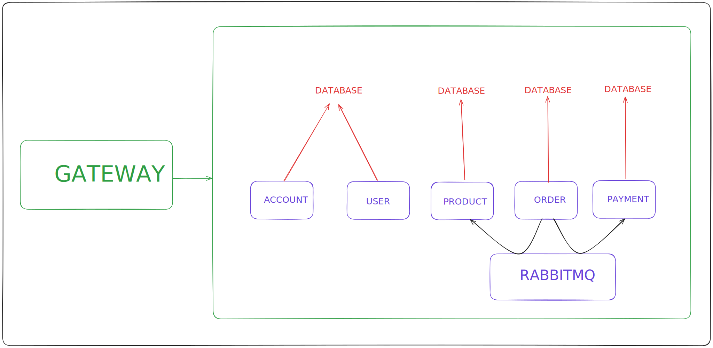

## 🔎 About the project

E-CommerceApp is a REST API for e-commerce stores, distributed in microservices, which has both operations performed for the customer, as well as operations performed by employees and administrators.

## 🖥️ Functionalities

- ✅ Users CRUD divided between `account-ms` and `users-ms`

- ✅ Authentication and authorization also divided between `account-ms` and `users-ms`

- ✅ Orders CRUD

- ✅ Products CRUD

- ✅ Parametrized search for products

- ✅ Payment persistence based on messaging

- ✅ Updates from related entities in different services through messaging

## 🛠️ Tecnologies

- [RabbitMQ](https://www.rabbitmq.com/)
- [Modelmapper](https://modelmapper.org/)
- [Lombok](https://projectlombok.org/)
- [Java JWT (Auth0)](https://github.com/auth0/java-jwt)
- [Libphonenumber](https://github.com/google/libphonenumber)
- [MySQL Connector/J](https://dev.mysql.com/downloads/connector/j/)
- [Spring Cloud Netflix](https://cloud.spring.io/spring-cloud-netflix/reference/html/)
- [Spring Cloud Gateway](https://spring.io/projects/spring-cloud-gateway)
- [Spring Cloud OpenFeign](https://spring.io/projects/spring-cloud-openfeign)
- [Spring Security Crypto](https://docs.spring.io/spring-security/reference/features/integrations/cryptography.html)
- [SpringBoot Starter JPA](https://spring.io/projects/spring-data-jpa)
- [SpringBoot Starter Web]()
- [SpringBoot Starter Validation](https://docs.spring.io/spring-framework/reference/core/validation/beanvalidation.html)
- [SpringBoot Devtools](https://docs.spring.io/spring-boot/docs/1.5.16.RELEASE/reference/html/using-boot-devtools.html)

## ⚙️ Application schema
